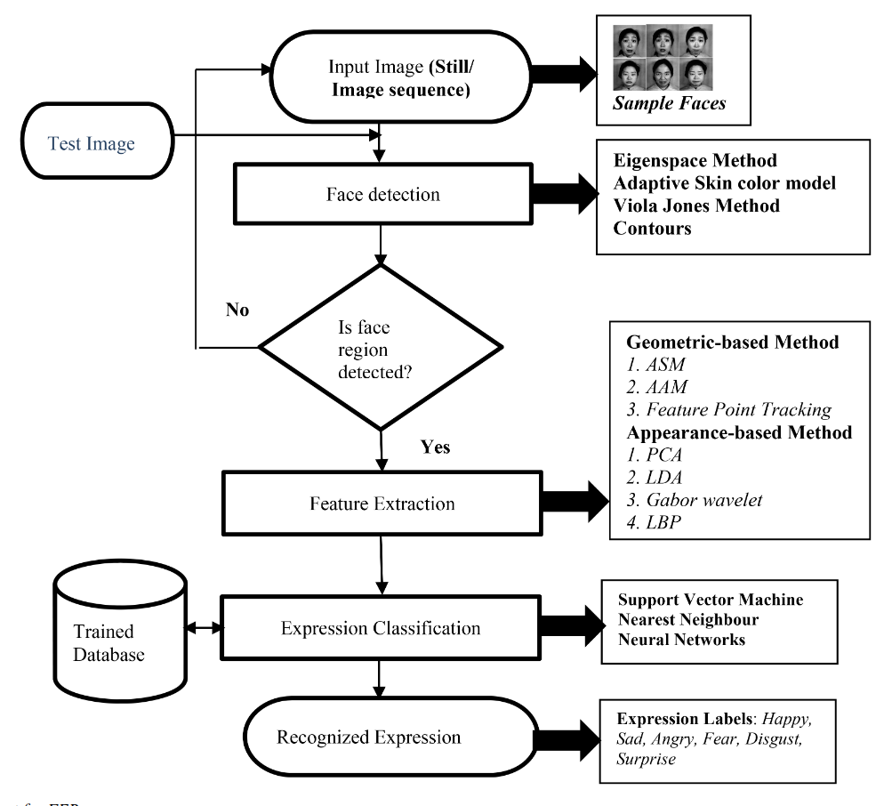
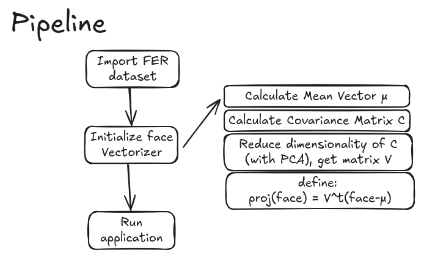
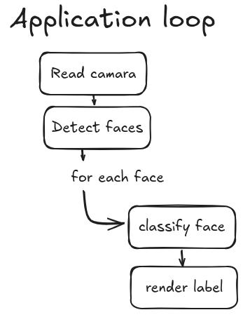
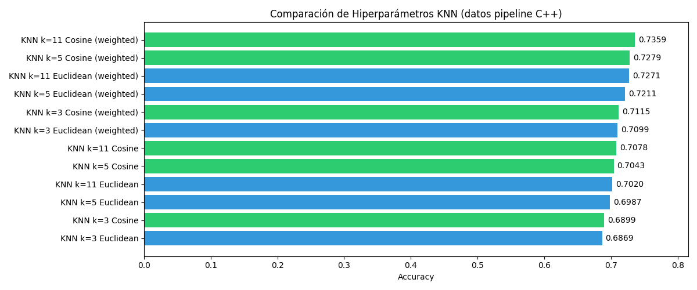
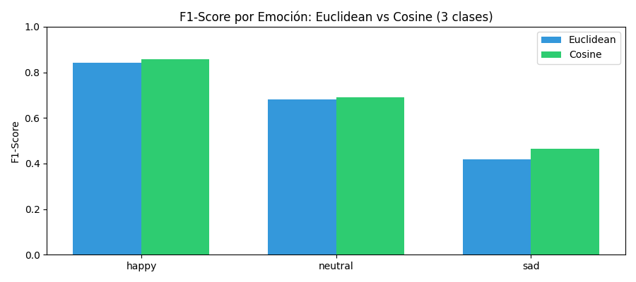

# FER con KNN SIMD optimizado 
Proyecto final Arquitectura y Organización del Computador - FCEN UBA

### Abstract 
Este proyecto es un clasificador de caras construido en base a `KNN`, `OpenCV` y `HaarExtractionAlgorithm`.



En este repositorio implementé un sistema de Face Emotion Recognition (FER) que utiliza un módulo de álgebra lineal implementado en *Assembly x86* para detectar y clasificar en RT caras según su estado de ánimo: feliz, triste, neutral. 

Para esto, tuve en cuenta las siguientes etapas:
- Elección del dataset.
- Manejo de las imagenes.
- Detección de caras en las imagenes.
- Extracción de features de las caras.
- Algoritmo de clasificación.

### Papers y referencias utilizadas
- [Haar Features, Viola & Jones Algorithm](https://www.merl.com/publications/docs/TR2004-043.pdf)
- [Facial expression recognition techniques](https://ietresearch.onlinelibrary.wiley.com/doi/epdf/10.1049/iet-ipr.2018.6647)
- [IVF Index for vector search](https://arxiv.org/pdf/2411.00970)
- [SIMD tips](https://officedaytime.com/simd512e/)
- [LBP Features](https://link.springer.com/chapter/10.1007/978-3-540-24670-1_36)

## Dataset
El dataset utilizado es **FER-2013**. Reduje las categorías de 7 a 3, ya que con los métodos clásicos de clasificación que elegí (sin redes neuronales ni otros modelos avanzados del state-of-art) no se alcanzaba una buena precisión. Además tuve que implementar un sistema de subsampling para la categoría `happy`, ya que los datos no estan balanceados, lo cual sesga a los clasificadores.

### Distribución
| label   |   count |
|:--------|--------:|
| happy   |    3884 |
| neutral |    2775 |
| sad     |    1545 |
| Suma ($N$)     |     8204 |


## Pipeline



## **Manejo de las imagenes**
Mi decisión fue utilizar `OpenCV` por ser una librería reconocida para el manejo de imagenes tanto en `C++` como su versión en `Python`.

## **Detección de caras en las imágenes**

Utilicé un modelo preentrenado de *HaarCascade*. 
En base al `xml` dentro de `src/face_detection` aplico un multiscale y obtengo todos los frames de las caras detectadas en la imagen.

## **Extracción de features de las caras**
Una vez recortada la imagen de la cara, para vectorizar esos píxeles realice distintas pruebas conjunto a distintos modelos clasificadores y terminé decidiendo por la siguiente estrategia:
~~~c
# 1. Resize del frame de la cara a un tamaño estandar 48x48.
# 2. Conversión a blanco y negro.
# 3. Ecualización del histograma de la imagen.
# 4. Extracción de features HOG de la imagen.
# 5. Proyección en un espacio reducido con PCA.
~~~

El sustento de esto es que para poder encontrar features distintivos de cada tipo de imagen, es útil asemejarlas en factores que nada tienen que ver con lo que queremos detectar, esto es las luces/iluminación del lugar de la imagen, el tamaño de la cara en la misma, luego aplico una extracción de features HOG, de la cual luego profundizo más, y finalmente aplico la proyección *PCA* para reducir el tamaño de los vectores de características que despues manipulo para computar la clasificación. Por defecto, dejé el `num_components` de PCA igual a 100, pero es configurable en `src/constants.h` (debe ser un multiplo de 4, para las optimizaciones que hice en SIMD posteriormente).

### Aplicación de PCA
La motivación para implementar PCA vino por parte de mi reciente cursada de ALC (Métodos Numéricos). A partir del estudio de las distintas descomposiciones de una matriz y cómo muestran estas propiedades inherentes de la misma, se puede estudiar la correlación entre componentes de un vector y colapsar aquellas que representen, en esencia, la misma información. 

**Prop:** Un vector $y$ representado en una base $B$ puede escribirse en otra base $V$ a partir de un cambio de base $[y]_V = C_{BV}[y]_B$.

Dado un vector feature de un rostro $x \in \mathbb{R}^{D}$, quiero proyectarlo a un subespacio definido por una base ortonormal $V_d = [v_1, ..., v_d]$ de dimension $d < D$, perdiendo la menor cantidad de información posible. Para medir la cantidad de información que pierdo uso una norma matricial entre la $X$ original y $\hat{X}$ una matriz que aproxima a $X$ pero de menor dimensión:

$$\min_{\text{rank}(\hat{X})=d} \| X - \hat{X} \|_F = \
\sum_{i=1}^{N} \| x_i - \hat{x}_i \|_2^2 \ 
= \sum_{j=d+1}^{D} \lambda_j
$$

**Definición:** La covarianza mide la dispersion alrededor del centro de los datos, entonces tengo que calcular antes un vector medio $\mu_ D$ y centrarlo antes de proyectar: $x-\mu_D$. En nuestro caso, los "datos" serían la matríz $X\in\mathbb{R}^{n \times D}$, con $n$ features de caras de dimension $D$ original.

La reconstrucción $\hat{X}$ puede hacerse a partir de $\hat{x}_i = \mu_D + V_d y_i$ con $y_i = V_d^T(x_i - \mu_D) \in \mathbb{R}^d$. Siendo $V_d$ la matríz cuyas columnas son los $d$ autovectores principales de la matriz de covarianza $C = \frac{1}{N} \tilde{X}^T \tilde{X}$, donde $\tilde{X} = (X - \mathbf{1}\mu_D^T)$. Además como $C$ es simétrica definida positiva, vale por el teorema espectral que existe una descomposición $C = V_d \Lambda V_d^T$, donde:
$V$ es una matriz ortogonal cuyas columnas son los autovectores de $C$ (direcciones principales),$\Lambda$ es una matriz diagonal que contiene los autovalores $\lambda_1 \ge \lambda_2 \ge \dots \ge \lambda_D \ge 0$ (varianza capturada en cada dirección).

En síntesis, la transformación $f: \mathbb{R}^D \rightarrow V_d$ se define como:
$$f(x_i) = V_d^T(x_i - \mu_D)$$

Para lo cual necesito precomputar con todos los datos que tengo $X^{n \times D}$ los valores de:
- $V_d$ a partir de la descomposición de $C$.
- $\mu_D$ el vector medio de $X$.

Esto lo hago en `init_vectorizer`.

## **Clasificación de caras**
Dado que hay muchas imagenes en el dataset, no tiene sentido computar en cada clasificación todas las distancias euclidianas entre features de la cara detectada y el resto de caras del dataset. Esto sería muy complejo computacionalmente $\mathcal{O}(N*d)$, pues el costo de computar las distancias euclidianas entre dos vectores de tamaño $d$ es $\mathcal{O}(d)$.

Deje implementados dos modelos de clasificación:
1. `CentroidClassifier` (no preferencial, KNN-Naive): Se calcula KNN sobre los centroides de cada categoría en el dataset (`happy`, `sad`, `neutral`). Para esto se tiene que precomputar cada centroide antes de ejecutar la aplicación principal en `init_vectorizer`. La complejidad computacional por clasificación es $\mathcal{O}(r*d)$ para $r$ categorías en el dataset y vectores de tamaño $d$.

2. `IVFClassifier` (preferencial, KNN más inteligente): Se calcula KNN sobre un subconjunto de caras cercanas a la cara a clasificar: tengo `C` clusters de vectores cercanos y sus centroides, me quedo con los `n_probe` clusters cuyo centroide está mas cercano a la imagen a clasificar, y entre todas las imágenes de ahí aplico KNN. Esta estrategia es la que me dió mejores resultados. Para lograr eficiencia, precomputo estos clusters/centroides con Kmeans en `init_vectorizer` y luego utilizo **minHeaps** como estruturas para computar los clusters selectos. La complejidad computacional por clasificación es $\mathcal{O}(C*d + m*M*d + k)$, siendo $C << N$ la cantidad total de clusters, $d$ el tamaño de los vectores, $m < C$ el valor `n_probe` (cantidad de clusters selectos), $M << N$ el tamaño máximo de esos clusters y $k$ el numero de vecinos en KNN.

Por estas consideraciones, al ejecutar la aplicación por defecto se carga el `IVFClassifier`. Se puede cambiar el modelo dentro de `constants.h`.

### Experimentación
Realicé unos experimentos para la selección de hiperparámetros en base al (están disponibles en `/experiments`). Obtuve los siguientes resultados:





## Ejecucion

#### Opcion Docker: 
```bash
# Build
docker compose build

# Run
xhost +local:docker
docker compose run fer bash
cd src && make pipeline
```

#### Opcion local: 
```bash
sudo apt update && sudo apt install pkg-config libopencv-dev
cd src && make pipeline
```
El debugging con `gdb` está habilitado en el `Makefile` para realizar tests/experimentos.
