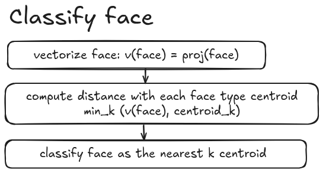

# Proyecto final Arquitectura y Organización del Computador - FCEN UBA :wrench:

Este proyecto es un clasificador de caras construido en base a `OpenCV`, `HaarExtractionAlgorithm` y 
`KNN`.

Papers relacionados:
> sdaeijfoaijdeoisjoifjsaoijdoiejsaoiefjsaoiejfoisajeoijsaeoi

### Pipeline
sdaeijfoaijdeoisjoifjsaoijdoiejsaoiefjsaoiejfoisajeoijsaeoi

#### Download dataset
sdaeijfoaijdeoisjoifjsaoijdoiejsaoiefjsaoiejfoisajeoijsaeoi

#### Initialize vectorizer
sdaeijfoaijdeoisjoifjsaoijdoiejsaoiefjsaoiejfoisajeoijsaeoi

#### Run application

 

